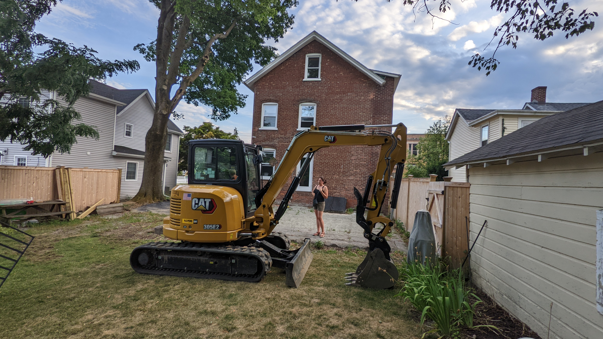
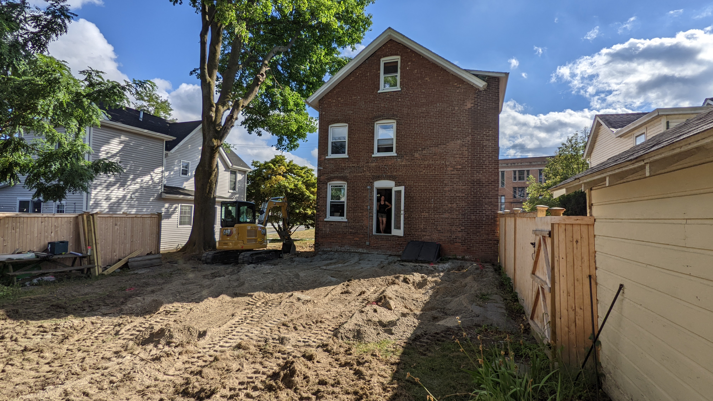
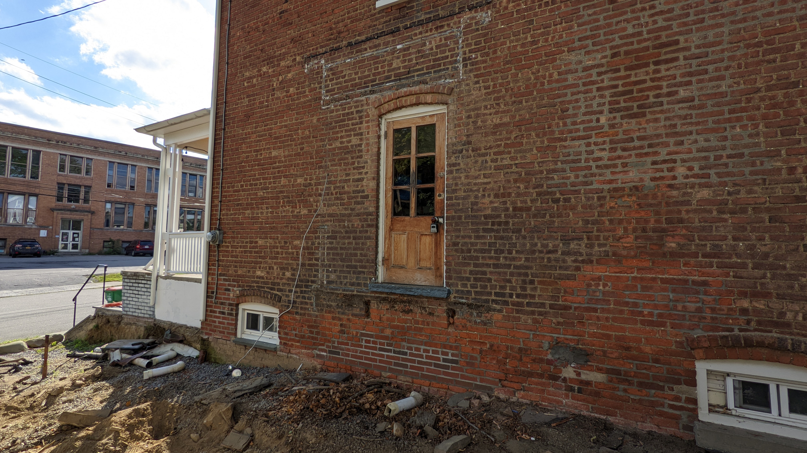

# Renovation 2022

## [Pre-start date](./log/000.md)

- Digger delivered
- Patio stones removed
- Fence/gate removed

Notes

This was done while we were out in St Louis. Strange to come back and have a segment of the fence just removed, with all the patio stones simply gone. The fence/gate parts were pushed to the back okf the property to reuse later. Boden loved playing in the dirt though.

## [Day 1 - 8/1/22](./log/001.md)

- Ripped up the asphalt driveway
- Tore down the side entrance
- Leveled the patio area

Notes

They ripped up the asphalt on the driveway, tore down the side entrance steps, and leveled the area that used to be the backyard patio. Big piles of debris; a mountain of broken earth & rocks are left to be scooped up.

## [Day 2 - 8/2/22](./log/002.md)

- Loaded debris into the skip

Notes

Using the digger, they scoop the asphalt debris into a large dump that was delivered at 8am. There's a lot of dust and we're sneezing.

