# Renovation 2022

## Before

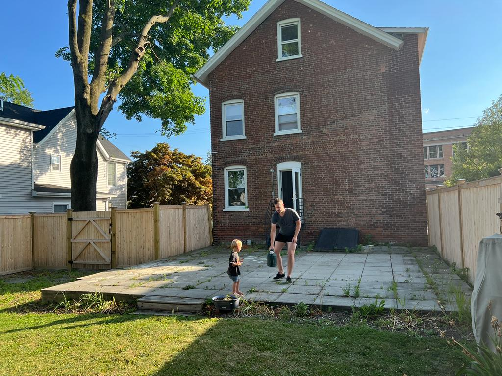

## Pre-start date

- Digger delivered
- Patio stones removed
- Fence/gate removed

Notes

_Jackson:_ This was done while we were out in St Louis. Strange to come back and have a segment of the fence just removed, with all the patio stones simply gone. The fence/gate parts were pushed to the back of the property to reuse later. Boden loved playing in the dirt though.

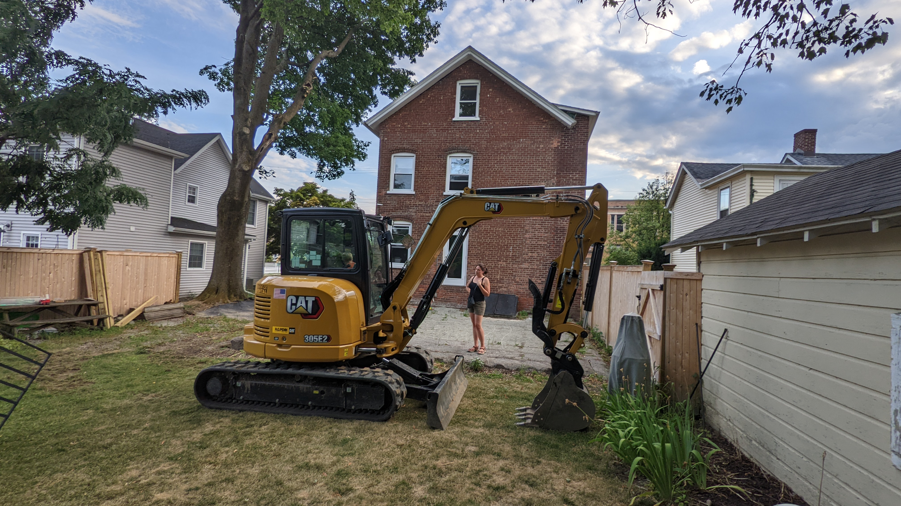

## Day 1 - 1/8/22

- Ripped up the asphalt driveway
- Tore down the side entrance
- Leveled the patio area

Notes

_Natalie:_ They ripped up the asphalt on the driveway, tore down the side entrance steps, and leveled the area that used to be the backyard patio. Big piles of debris; a mountain of broken earth & rocks are left to be scooped up.

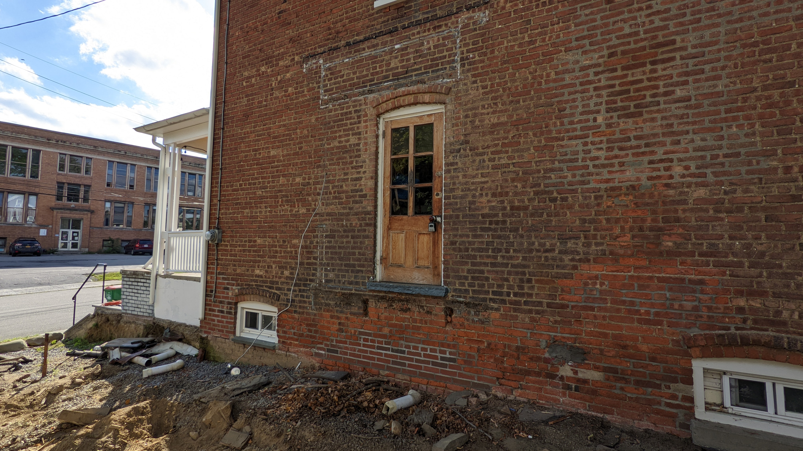
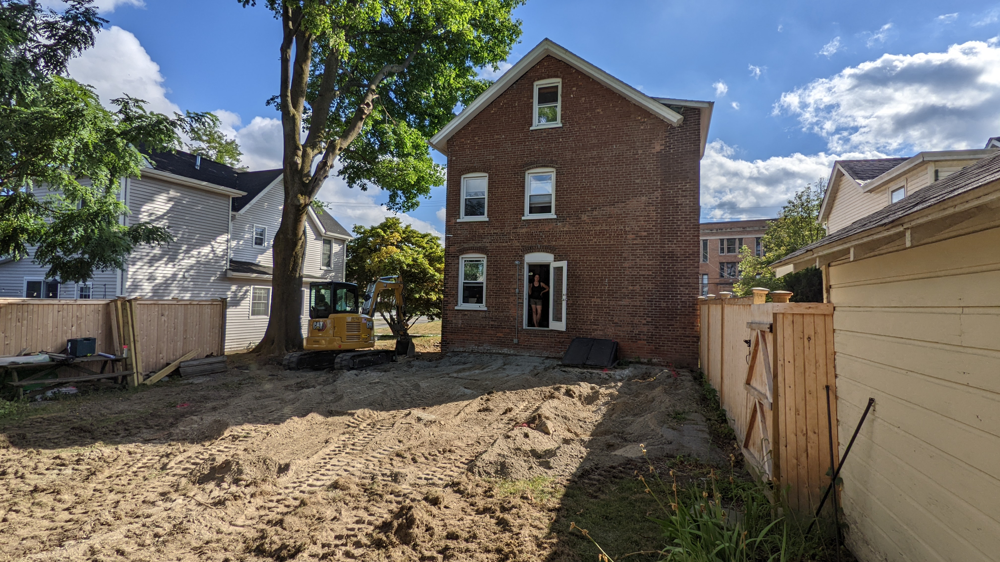

## Day 2 - 2/8/22

- Loaded asphalt debris into the skip
- Skip was taken away
- Ripped out bilco door, stairs, and cinder block walls
- Dug a deep hole for part of the basement foundation
- Delivered a bulldozer
- Ordered the portaloo

Notes

_Natalie:_ Using the digger, they scoop the asphalt debris into a large dump that was delivered at 8am. There's a lot of dust and we're sneezing. Over the course of the day, they demolished the basement Bilco door & stairs and created a large trough reaching back into the property. The boys stood in it at the end of the day and sides came up over Jackson's head.

_Jackson:_ There looks to be the reminants of an old ceramic drain pipe stretching the length of the hole. I wonder what it was for? There's so much dirt piled up it's hard to get to the back of our yard without clambering over things. After they finished for the day, we went out our basement door, which now sits about a meter above the bottom of the pit.  

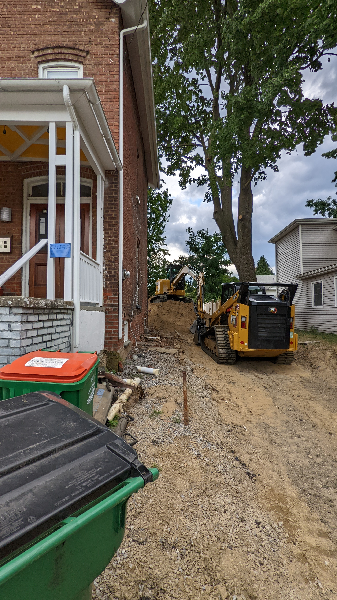
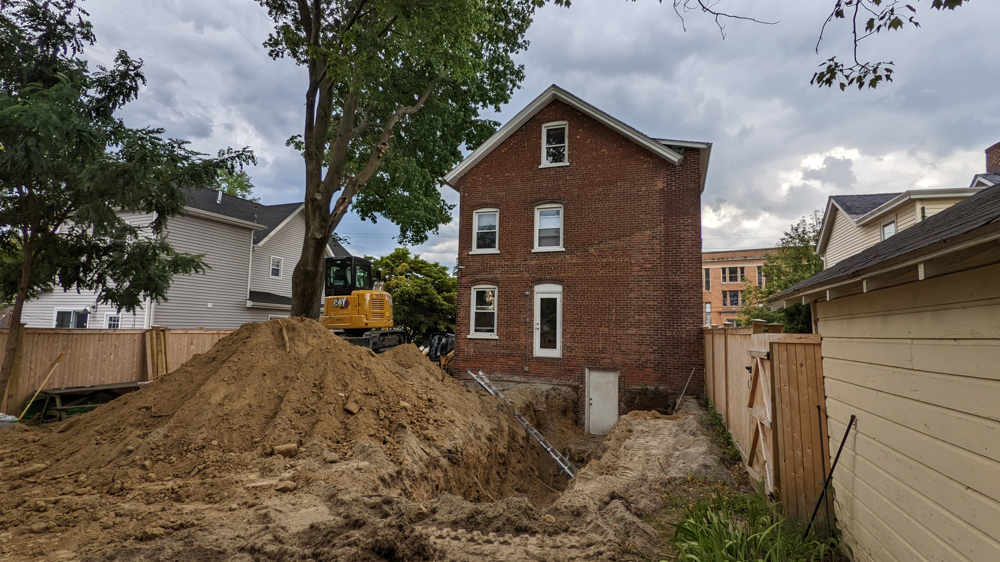

## Day 3 - 3/8/22

- Dump truck arrived to start hauling dirt away
- Portaloo delivered
- Much more of the foundation hole was dug, roughly an 'L' shape

Notes

_Jackson:_ The hole is **huge**. Started stressing out that it was representative of the eventual size of the extension, however it sounds like they're digging at least several feet extra in all directions. I guess it makes it easier to form the foundation. There was good news regarding the dirt dumping: Apparently the usually have to drive the truck all the way to Poughkeepsie to dump the dirt, however it just so happens that a local electrician who was working nearby needs a canyon on his property filled, so they only have to haul it there. Score!

_Natalie:_ A big dump truck came at 7:30am and the digger immediately started to shovel the mountain of dirt into the dump: Big job. The shadow of the digger swept across the kitchen all morning. 2 man operation around 1pm.: one moving huge piles of dirt via front loader to the dump truck down the driveway while the other digs and digs in the back!

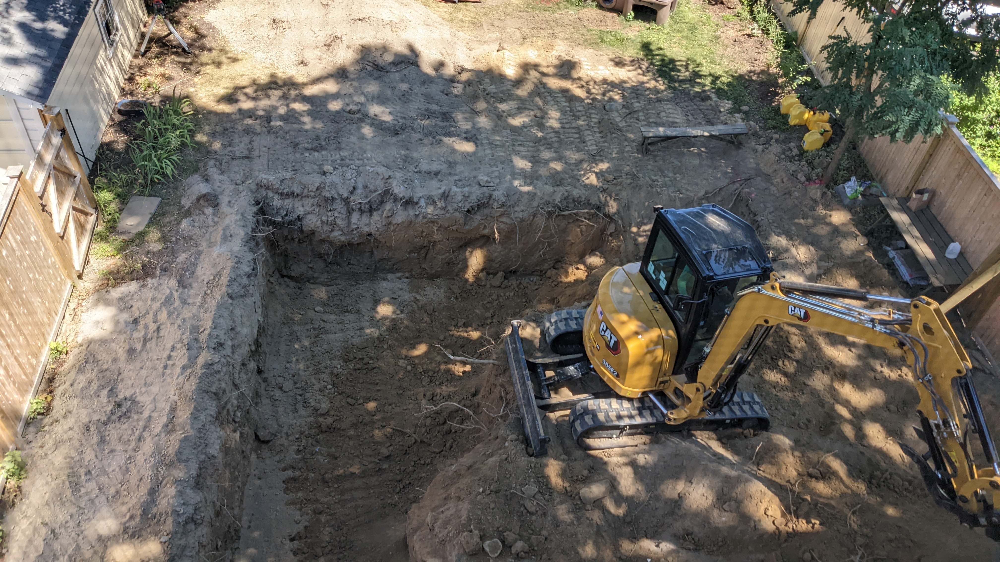
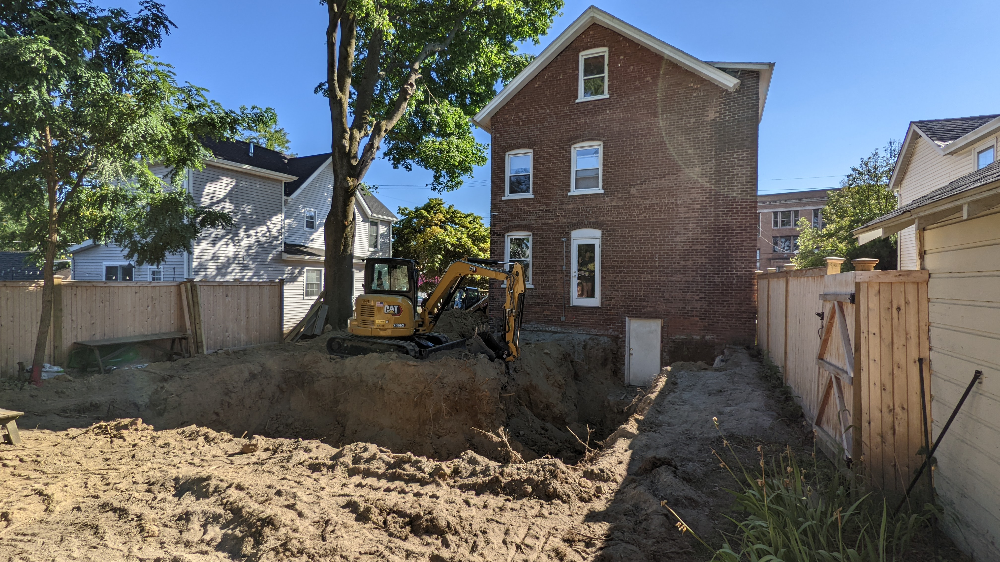

## Day 4 - 4/8/22

- Continued digging, and finished the hole for the main extension
- They'll tidy that, and have the foundation poured and then move on to digging for the mud room, since there's not enough space to do them concurrently
- Discovered the old well to the house
- Ripped out the step just outside the basement door
- We showed our neighbours around the pit

Notes

_Jackson:_ Arrived at 7:15am, got started soon after. A lot of the same today. Were told we have to have money available for the foundation guy on monday, cash. Paying cash gives us a good discount.

_Natalie:_ Finished the hole! They built a ramp to the bottom where we promptly went once they were gone. Standing at the bottom we discovered they'd uncovered a well -so coll! Catherine, Larry and Jenni came over to see the pit as well. We all amrvelled at the walls of dirt going over our heads. No discoveries of hidden treasures, though. No glass bottles, crockery or anything other than a little garbage and rocks.

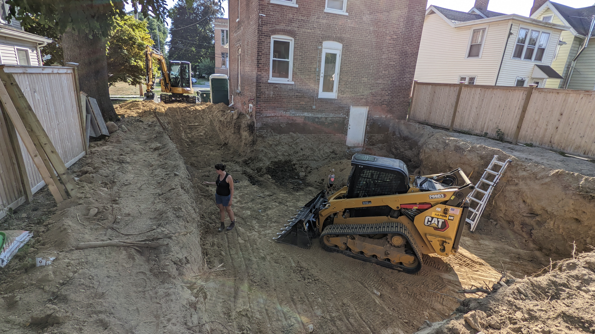

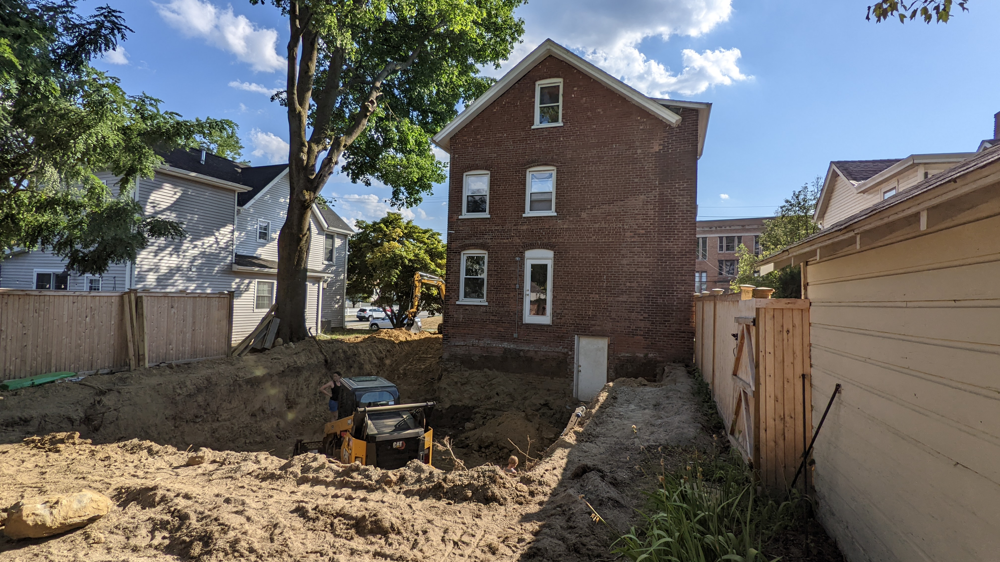

## Day 5 - 5/8/22

- A couple of guys game to look around in the pit first thing, no action after that
- The digger was back at it for a couple of hours in the afternoon to tidy things up in preparation for next week

Notes

_Natalie:_ Quiet today - wasn't util 2:30 that anyone showed up to do anything. Ted says they only need to "clean up" and prep for the groundwork that needs to be in for the foundation coming in next week.

[3d View of the Pit](https://photos.app.goo.gl/D4zPfeZYjUgYHWk99)

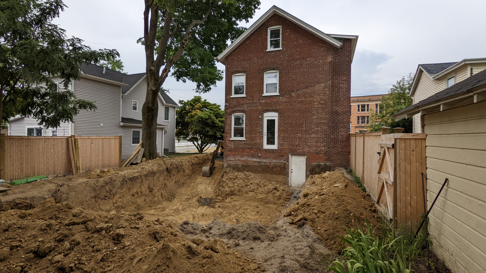

