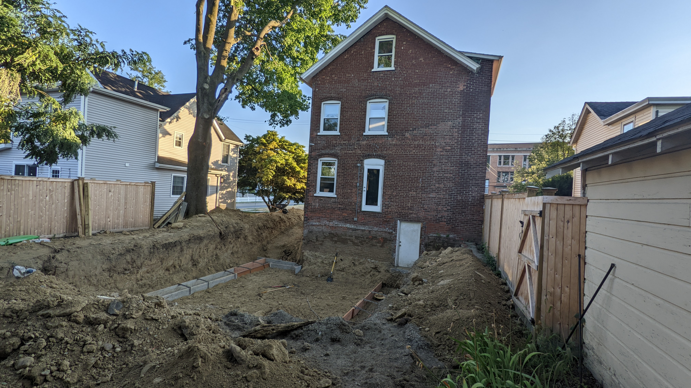
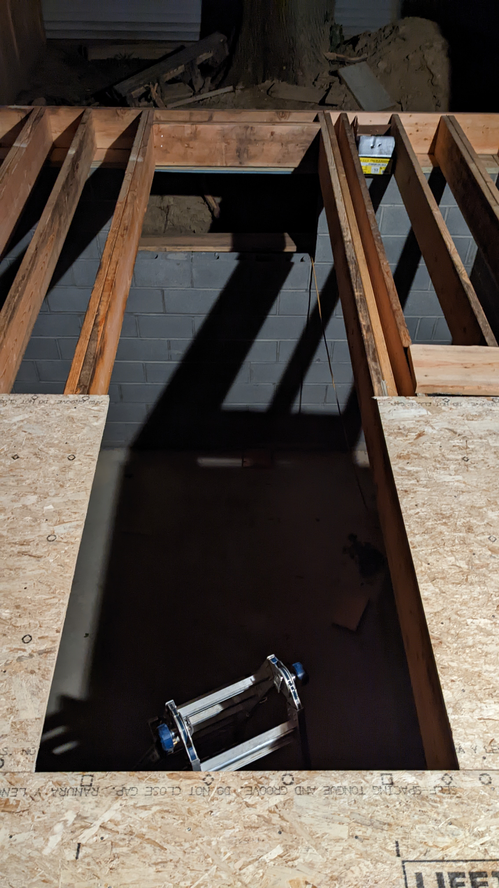
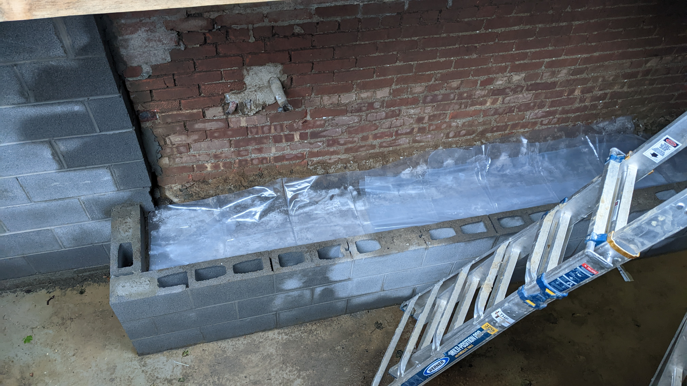
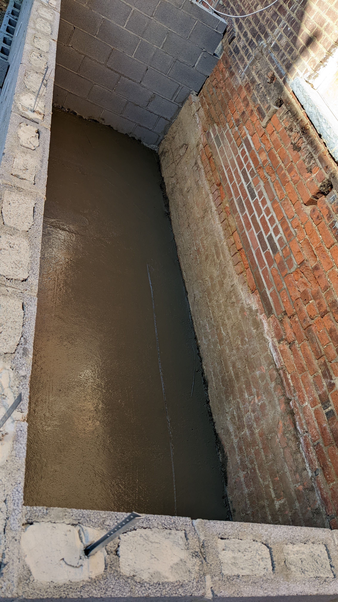

# Renovation 2022

  
Week 1

  <ul>
    <li><a href="#000">Pre-start</a></li>
    <li><a href="#001">1/8/22</a></li>
    <li><a href="#002">2/8/22</a></li>
    <li><a href="#003">3/8/22</a></li>
    <li><a href="#004">4/8/22</a></li>
    <li><a href="#005">5/8/22</a></li>
    <li><a href="#006">6/8/22</a></li>
  </ul>

  
Week 2

  <ul>
    <li><a href="#007">8/8/22</a></li>
    <li><a href="#008">9/8/22</a></li>
    <li><a href="#009">10/8/22</a></li>
    <li><a href="#010">11/8/22</a></li>
  </ul>

  
Week 3

  <ul>
    <li><a href="#011">15/8/22</a></li>
    <li><a href="#012">16/8/22</a></li>
    <li><a href="#013">17/8/22</a></li>
    <li><a href="#014">18/8/22</a></li>
  </ul>

  
Week 4

  <ul>
    <li><a href="#015">22/8/22</a></li>
    <li><a href="#016">24/8/22</a></li>
    <li><a href="#017">25/8/22</a></li>
    <li><a href="#018">26/8/22</a></li>
  </ul>

  
Week 5

  <ul>
    <li><a href="#019">29/8/22</a></li>
    <li><a href="#020">30/8/22</a></li>
    <li><a href="#021">31/8/22</a></li>
    <li><a href="#022">01/9/22</a></li>
    <li><a href="#023">02/9/22</a></li>
  </ul>

  
Week 6

  <ul>
    <li><a href="#024">06/9/22</a></li>
    <li><a href="#025">07/9/22</a></li>
    <li><a href="#026">08/9/22</a></li>
    <li><a href="#027">10/9/22</a></li>
  </ul>

  
Week 7

  <ul>
    <li><a href="#028">12/9/22</a></li>
    <li><a href="#029">13/9/22</a></li>
    <li><a href="#030">15/9/22</a></li>
    <li><a href="#031">16/9/22</a></li>
  </ul>

  
Week 8

  <ul>
    <li><a href="#032">19/9/22</a></li>
    <li><a href="#033">20/9/22</a></li>
    <li><a href="#034">21/9/22</a></li>
    <li><a href="#035">23/9/22</a></li>
  </ul>

  
Week 9

  <ul>
    <li><a href="#036">26/9/22</a></li>
    <li><a href="#037">27/9/22</a></li>
    <li><a href="#038">28/9/22</a></li>
    <li><a href="#039">29/9/22</a></li>
    <li><a href="#040">30/9/22</a></li>
  </ul>

## Before

## Pre-start date

- Digger delivered
- Patio stones removed
- Fence/gate removed

Notes

_Jackson:_ This was done while we were out in St Louis. Strange to come back and have a segment of the fence just removed, with all the patio stones simply gone. The fence/gate parts were pushed to the back of the property to reuse later. Boden loved playing in the dirt though.

<a href='#top'>Back to Top</a>

## Day 1 - 1/8/22

- Ripped up the asphalt driveway
- Tore down the side entrance
- Leveled the patio area

Notes

_Natalie:_ They ripped up the asphalt on the driveway, tore down the side entrance steps, and leveled the area that used to be the backyard patio. Big piles of debris; a mountain of broken earth & rocks are left to be scooped up.

<a href='#top'>Back to Top</a>

## Day 2 - 2/8/22

- Loaded asphalt debris into the skip
- Skip was taken away
- Ripped out bilco door, stairs, and cinder block walls
- Dug a deep hole for part of the basement foundation
- Delivered a bulldozer
- Ordered the portaloo

Notes

_Natalie:_ Using the digger, they scoop the asphalt debris into a large dump that was delivered at 8am. There's a lot of dust and we're sneezing. Over the course of the day, they demolished the basement Bilco door & stairs and created a large trough reaching back into the property. The boys stood in it at the end of the day and sides came up over Jackson's head.

_Jackson:_ There looks to be the reminants of an old ceramic drain pipe stretching the length of the hole. I wonder what it was for? There's so much dirt piled up it's hard to get to the back of our yard without clambering over things. After they finished for the day, we went out our basement door, which now sits about a meter above the bottom of the pit.  

<a href='#top'>Back to Top</a>

## Day 3 - 3/8/22

- Dump truck arrived to start hauling dirt away
- Portaloo delivered
- Much more of the foundation hole was dug, roughly an 'L' shape

Notes

_Jackson:_ The hole is **huge**. Started stressing out that it was representative of the eventual size of the extension, however it sounds like they're digging at least several feet extra in all directions. I guess it makes it easier to form the foundation. There was good news regarding the dirt dumping: Apparently the usually have to drive the truck all the way to Poughkeepsie to dump the dirt, however it just so happens that a local electrician who was working nearby needs a canyon on his property filled, so they only have to haul it there. Score!

_Natalie:_ A big dump truck came at 7:30am and the digger immediately started to shovel the mountain of dirt into the dump: Big job. The shadow of the digger swept across the kitchen all morning. 2 man operation around 1pm.: one moving huge piles of dirt via front loader to the dump truck down the driveway while the other digs and digs in the back!

<a href='#top'>Back to Top</a>

## Day 4 - 4/8/22

- Continued digging, and finished the hole for the main extension
- They'll tidy that, and have the foundation poured and then move on to digging for the mud room, since there's not enough space to do them concurrently
- Discovered the old well to the house
- Ripped out the step just outside the basement door
- We showed our neighbours around the pit

Notes

_Jackson:_ Arrived at 7:15am, got started soon after. A lot of the same today. Were told we have to have money available for the foundation guy on monday, cash. Paying cash gives us a good discount.

_Natalie:_ Finished the hole! They built a ramp to the bottom where we promptly went once they were gone. Standing at the bottom we discovered they'd uncovered a well -so coll! Catherine, Larry and Jenni came over to see the pit as well. We all amrvelled at the walls of dirt going over our heads. No discoveries of hidden treasures, though. No glass bottles, crockery or anything other than a little garbage and rocks.

<a href='#top'>Back to Top</a>

## Day 5 - 5/8/22

- A couple of guys game to look around in the pit first thing, no action after that
- The digger was back at it for a couple of hours in the afternoon to tidy things up in preparation for next week

Notes

_Natalie:_ Quiet today - wasn't util 2:30 that anyone showed up to do anything. Ted says they only need to "clean up" and prep for the groundwork that needs to be in for the foundation coming in next week.

[3d View of the Pit](https://photos.app.goo.gl/D4zPfeZYjUgYHWk99)

<a href='#top'>Back to Top</a>

## Day 6 - 6/8/22

- Didn't expect them on a Saturday, but arrived around 8 and got to work smoothing out the pit

Notes

_Jackson:_ It's dry so you can clearly see where the old well was. Pretty cool! The pit looks smooth and ready to go to me, but what do I know?

_Natalie:_ Boris showed up and dithered in the back a bit. He flattened the surfaces with the digger for a while in prep for Monday.

<a href='#top'>Back to Top</a>

## Day 7 - 8/8/22

- Bunch of dudes showed up early, looked like they were planning
- Laid the wooden templates for the base of the foundation, laid rebar
- Excavator was picked up, and the skid steer dropped off again
- Bit of tidy up on the driveway

Notes

_Jackson:_ I don't know anything about the templates, but it seems like they've boxed in the outer edges of the new extension, while leaving the base of the existing house alone. There must be a reason, but I don't know what. Maybe it's just not necessary?

_Natalie:_ Some big, beefy guys came and laid out wooden boards and metal rods for a mold of what looks like the base of our foundation and walls. Exciting to see the outline of the house!

<a href='#top'>Back to Top</a>

## Day 8 - 9/8/22

- More fussing with the drive. The ramp down to the pit is now shorter and steeper
- Electrician came by to look at the plans/basement
- Pouring of the foundation kicks off tomorrow, in the following order:
  - Concrete poured into the templates for the footing
  - Interior filled with gravel
  - Concrete slab poured over the gravel
  - Cinder blocks to build out the walls

Notes

_Jackson:_ Once the basement of the main extension is done, they'll need to regroup to dig the foundation for the mud room. There just wasn't enough room to do both at once. I'm sure it'll cost us more doing it this way, but there really was no other option.

<a href='#top'>Back to Top</a>

## Day 9 - 10/8/22

- Foundation guys arrived at 6:30am to put some finishing touches in before the concrete truck arrived
- 7:30am concrete truck arrived, got set up, and they started pouring
- 8am finished pouring and smooth out the concrete

Notes

_Jackson:_ There's a barrier in the far wall of the foundation where the concrete is higher on one side than the other. Not sure why, but it looks very intentional. Might ask Ted at some point.

<a href='#top'>Back to Top</a>

## Day 10 - 11/8/22

- Arrived early to strip the wooden boards off of the now dried concrete
- Removed the larger rocks from inside the foundation area in preparation for the gravel
- Made the ramp to the pit longer and less steep
- Filled the outer walls with gravel and packed it down

Notes

_Jackson:_ Tomorrow they'll start building up the basement walls. Once it's about 1/3rd complete, they'll pour the concrete slab for the floor, then continue with the walls. Doing it that way saves having to rent a pump truck for the concrete, which saves us about $2k.

<a href='#top'>Back to Top</a>

## Day 11 - 15/8/22

- Delivered 6 loads of concrete blocks for the foundation walls
- Dropped off some gear

Notes

_Jackson:_ It's felt like ages since any progress was made, but in reality it's been about 3 and a half days, 2 of which were the weekend. Probably unresonable for me to feel eager for things to keep moving. I spoke to Ted, and he was optimistic that things would be finished by Thanksgiving. If that's the case, I'll be very happy.

<a href='#top'>Back to Top</a>

## Day 12 - 16/8/22

- Showed up to start building up the walls
- Lots of mixing concrete, laying brick, rinse and repeat

Notes

<a href='#top'>Back to Top</a>

## Day 13 - 17/8/22

- More brick laying, got to full height in a couple of places

Notes

<a href='#top'>Back to Top</a>

## Day 14 - 18/8/22

- Finished up as much of the walls as they're doing for now
- Used a machine to pack down the gravel in the foundation
- Laid down some insulation 
- Moved a bunch of blocks over to the bilco door spot
- The floor slab will be poured on Monday, and once that's done they'll finish the walls

Notes

<a href='#top'>Back to Top</a>

## Day 15 - 22/8/22

- Inspector came by to give the go ahead for pouring the slab

Notes

_Jackson:_ Spoke to Ted about what we want to do regarding the finish of the basement. We'll go with a polished concrete floor (i.e. nothing special), and paint the cinderblock walls. We still need to ask if we can do surface mounted electrical outlets. 

It sounds like they're not going to backfill around the foundation until the first floor framing is done, which is a bit of a pain. It would be nice to regain easy access to our back lawn while the weather is nice so that Bodie can play back there again.

<a href='#top'>Back to Top</a>

## Day 16 - 24/8/22

- The team arrived before 7am to get ready for the concrete truck
- Concrete truck arrived soon after
- Poured the slab and smoothed it out
- Gone by 8:15am

Notes

_Jackson:_ Will continue finishing the walls of the foundation tomorrow, including boxing in the bilco door area. Fingers crossed we'll have a finished basement by the end of the day. There's still an open wall of dirt between the new basement floor and the bottom of the old foundation. Unsure what they're going to do with that, but I'd assume they'll seal it up and cover it with concrete at some point? Time will tell.

<a href='#top'>Back to Top</a>

## Day 17 - 25/8/22

- Got a delivery of some more concrete
- Moved a bunch of the concrete blocks by hand down into the basement
- Built the walls for the bico door entry

Notes

<a href='#top'>Back to Top</a>

## Day 18 - 26/8/22

- Sealed the outside of the basement walls with concrete
- Started building the interior wall which will bring the extension basement floor up to the level of the current foundation
- Started building up the remaining walls, leaving a gap to get in and out
- Scaffolding equipment arrived so they can finish the full height easily

Notes

_Jackson:_  I'm always off when I guess they're going to finish something. I probably have unrealistically high expectations for how quickly this stuff can be done.

<a href='#top'>Back to Top</a>

## Day 19 - 29/8/22

- Continued building up the wall
- Continued sealing the outside

Notes

<a href='#top'>Back to Top</a>

## Day 20 - 30/8/22

- Finished building up the wall
- Finished sealing the outside

Notes

_Jackson:_ Still no concrete slab in the bilco door enclosure, nor has the step from the old foundation to the new been filled in.

<a href='#top'>Back to Top</a>

## Day 21 - 31/8/22

- Waterproofing truck showed up
- Sprayed some kind of black waterproofing layer onto the outside of the foundation walls
- Attached what looks like a kind of bubble wrap type thing to the outside of the walls

Notes

_Jackson:_ Got word that they should be starting on the framing for the first floor tomorrow!

<a href='#top'>Back to Top</a>

## Day 22 - 01/9/22

- Late morning the materials were dropped off
- Soon after the framers showed up and made short work of getting started
- Most of the framing complete with a good half of the floor done

Notes

_Jackson:_ Determining where to drop the materials took a bit of manuvering for the delivery guy. The framers work quickly. Got started around lunch time and made short work of getting the floors installed. The plan is for it to be finished today so that tomorrow the bulldozer can come and backfill around the foundation walls, and make a start at digging the pit for the mud room foundation.

<a href='#top'>Back to Top</a>

## Day 23 - 02/9/22

- Excavator was dropped off, in preparation for digging the mud room foundation next week

Notes

_Jackson:_ After watching the framing guys hustle into the dark to try and finish the floor the previous night, we expected them to be here today to finish up. Was not the case. Probably had another job lined up.

<a href='#top'>Back to Top</a>

## Day 24 - 06/9/22

- Rain
- Brick shopping for the outside of the foundation

Notes

_Jackson:_ Thought I'd be clever and grab an old brick from the pile of dirt so that we had a good comparison when brick shopping. Jumped off the steps onto the dirt next to the excavator and promptly sunk calf deep in mud. Took a step, and my shoe stayed in the mud. Laughing like a lunatic, I powered on bare foot. Retreived the brick.

<a href='#top'>Back to Top</a>

## Day 25 - 07/9/22

- The guys came to finish the floor framing
- Started digging the mudroom foundation pit
- Filled in the step inside the basement, ready for concrete to be poured over
- Hit the gas main
- 3 fire trucks, the fire chief car, and 2 trucks from Central Hudson showed up
- Closed off the gas, repaired the piping, moved the meter out of the basement to beside the house

Notes

_Jackson:_ The drama. Felt like one thing after the other today, though really the gas main was just the catalist for a busy day.

<a href='#top'>Back to Top</a>

## Day 26 - 08/9/

- Picked up the excavator
- Dropped of some wood for framing

Notes

<a href='#top'>Back to Top</a>

## Day 27 - 10/9/22

- Showed up unexpected on a Saturday and started the framing for the walls
- Were there for about 2 hours then left, coming back Monday

Notes

_Jackson:_ Unfortunatley timing. I had just laid down to take a nap when they showed up. The irregular banging and nail gun sounds meant it was impossible to really sleep. I dozed for 15 mins then got up.

<a href='#top'>Back to Top</a>

## Day 28 - 12/9/22

- The guys showed up and dug a trench from the mudroom pit to the street
- Backfilled the backyard pit, buy hand, for the rest of the day

Notes

<a href='#top'>Back to Top</a>

## Day 29 - 13/9/22

- Received a load of dirt dumped in the driveway
- The guys continued backfilling by hand

Notes

_Jackson:_ Feels a bit weird having shipped off a bunch of dirt when the pit was being dug, only to have to order more to replace it when it was time to backfill. I don't think there was much else to be done. Too much dirt was removed, and we just don't have anywhere that it could have been stored until backfilling time. Felt sorry for the guys having to do it manually, but the excavator should be back on Friday (along with more dirt) to continue the job.

<a href='#top'>Back to Top</a>

## Day 30 - 15/9/22

- Foundation guys showed up again, built out the framing for the mudroom foundation footing
- Filled with concrete
- Ordered a container unit which we can store on the street outside our house, we'll use this for furniture and stuff when we need to get out of the way for interior work

Notes

<a href='#top'>Back to Top</a>

## Day 31 - 16/9/22

- Got some deliveries: a bunch more cinder blocks and a large pile of dirt
- Skid steer loader dropped off
- The concrete overhang in the bilco door enclosure was chipped away at to prepare for that slab to be filled

Notes

_Jackson:_ Expecting a bunch of activity next week. Backfilling should be complete. Mudroom foundation should be complete. Two of the windows in the current basement will be filled in with brick, since they intersect the mudroom.

We're hoping that we can retain a vent for the drier. Eventually we'll have a drier in the mudroom, but until that time, we still want to be able to use our existing one. There's also the danger of appliances being back ordered, so we may not be able to get new washer/drier into the mudroom right away.

They're also planning on blowing out the wall of the existing basement to connect it to the new basement next week. Exciting, but nerve-racking. It will be cool to be able to walk from basement to basement.

<a href='#top'>Back to Top</a>

## Day 32 - 19/9/22

- Started laying the cinderblocks for the mudroom basement walls
- Removed one of the existing basement windows (mudroom will intersect)

Notes

<a href='#top'>Back to Top</a>

## Day 33 - 20/9/22

- Finished the mudroom basement walls
- Started backfilling the backyard

Notes

_Jackson:_ During backfilling, the fence was clipped. We're working with pretty narrow space, so a panel of the fence is all but destroyed. It'll be replaced.

<a href='#top'>Back to Top</a>

## Day 34 - 21/9/22

- Finished backfilling the yard
- Setup to pour the pillar footing for the stairs from the extension to the backyard
- Filled the bilco door area, the step in the new basement, and the mudroom basement with gravel/insulation to prep for them to be filled with concrete

Notes

<a href='#top'>Back to Top</a>

## Day 35 - 23/9/22

- Rained yesterday so no real work was done
- Framers showed up today and got to work installing a beam in the basement ceiling to solidify the floor
- Finished framing out the walls of the first floor
- Added exterior panels
- Added temporary bracing

Notes

<a href='#top'>Back to Top</a>

## Day 36 - 26/9/22

- Masons arrived early with the concrete truck
- Filled in the slab for the mudroom basement, basement step, bilco door, and footing for the eventual stairs down to the lawn level

Notes

<a href='#top'>Back to Top</a>

## Day 37 - 27/9/22

- Wood delivery. Nothing else

Notes

_Jackson:_ Getting a little frustrated at the days such as today where weather and conditions are perfect, yet nothing gets done. Was assured that the framers would be there tomorrow, now that all the wood has been delivered.

<a href='#top'>Back to Top</a>

## Day 38 - 28/9/22

- Framers arrived late in the day, and got about 2 hours of work done. Cut out the windows/doors, and framed out the pantry

Notes

_Jackson:_ I was in NYC for work today, and left with grand hopes of coming home to a drastically different state of things. That was not really the case.

<a href='#top'>Back to Top</a>

## Day 39 - 29/9/22

- Framers arived later in the day again. Got started on the ceiling framing
- Paulo put up plastic surrounding the spot in the basement where the wall would be cut tomorrow

Notes

<a href='#top'>Back to Top</a>

## Day 40 - 30/9/22

- Cut through the existing basement wall to join the old with the new
- Framers finished laying the floor of the second floor
- Started sizing out the wood for the mudroom
- Marked out the walls for the second floor (bedroom, closet, bathroom, tub room)

Notes

_Jackson:_ Lots of activity today. Was fairly distracting trying to work with it all going on. At various times during the cutting the entire building seemed to vibrate. Exciting to see everything coming together. We were able to walk out onto the second floor this evening (climbing through our bedroom window). Feeling a little aprehensive about the plans, as now that things are getting closed up the kitchen is beginning to feel much darker. We don't really have any options for adding a window. Hoping that once the wall is opened up to the new greatroom, and the walls are finished the light will permeate better.

<a href='#top'>Back to Top</a>

## Day 41 - 05/10/22

- No activity Monday and Tuesday, except for the storage pod arriving on Tuesday
- Windows arrived today (Wednesday), mostly stashed around back in the extension, with a little overflow put in the storage unit

Notes

<a href='#top'>Back to Top</a>

## Day 42 - 06/10/22

- Framers arrived early and got to work. Didn't stop, except for lunch, until a little after 5
- Framed out the walls of the second floor
- Started adding the ceiling beams
- Pulled down the supports on the 1st floor
- Installed the outer frame of the bilco door

Notes

<video controls>
  <source src="/logs/042/042.mp4" type="video/mp4">

<a href='#top'>Back to Top</a>

